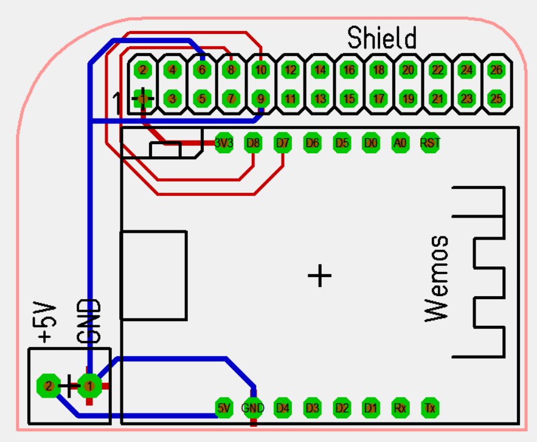
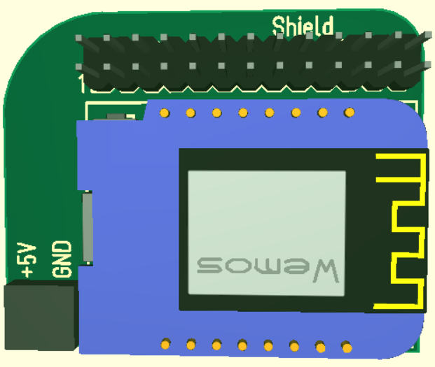
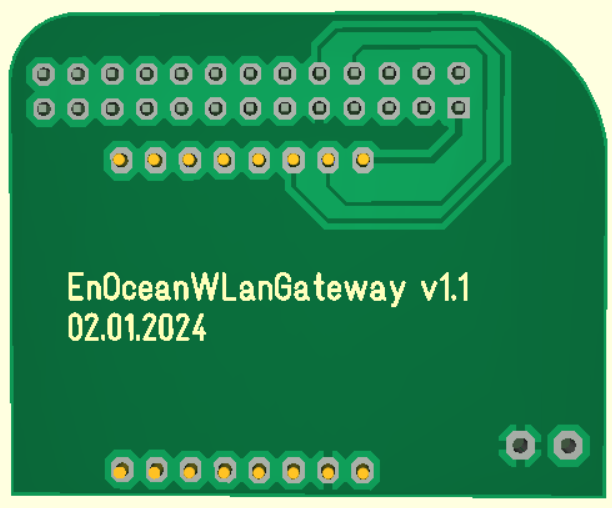
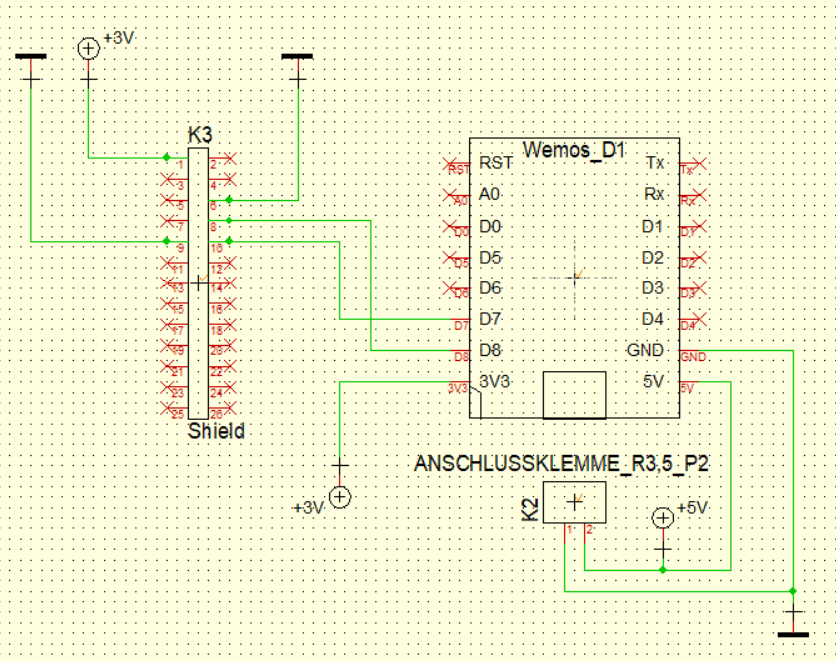
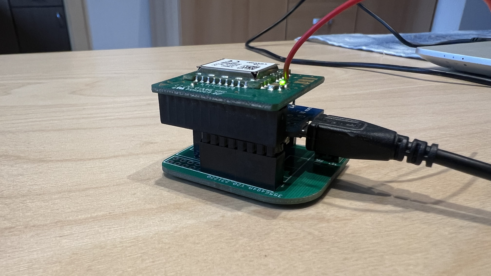
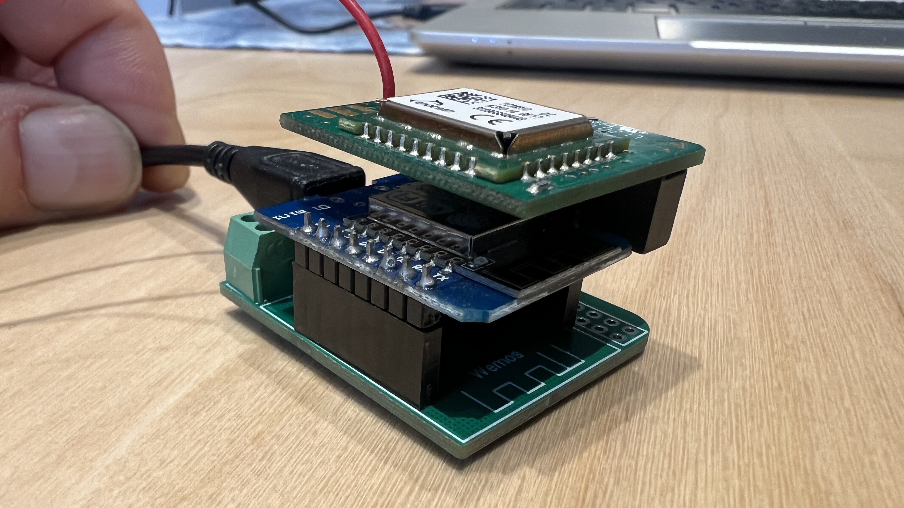
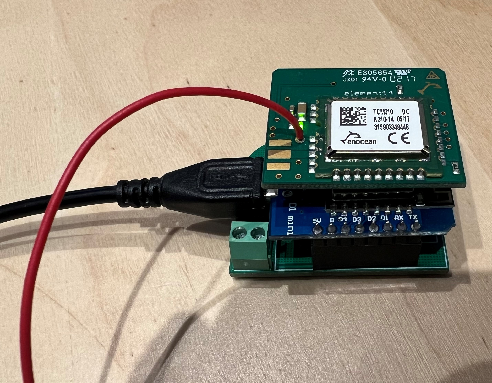

# EnOceanWLanGateway
<table><tr>
<td>

</td><td>

</td><td>
 
</td><td>

</td>
</tr><tr>
<td>

</td><td>

</td><td>
 
</td><td>
</td>
</tr>
</table>

## Anleitung
* Jeelabs ESP-Link auf den ESP8266 flashen
* uC-Console -> Baudrate auf 57600 stellen
* Pin Assignment setzen
  * Reset: disabled
  * ISP/Flash: disabled
  * Conn. LED: disabled
  * Serial LED: disabled
  * UART Pins: swapped
  * RX pullup: ok
 
FHEM Definition:
<pre>defmod EnOceanGateway TCM ESP3 &#60;ipadresse&#62;:23</pre>
 
Den ESP8266 kann man auch direkt auf die Platine löten, dann wird alles insgesamt flacher
